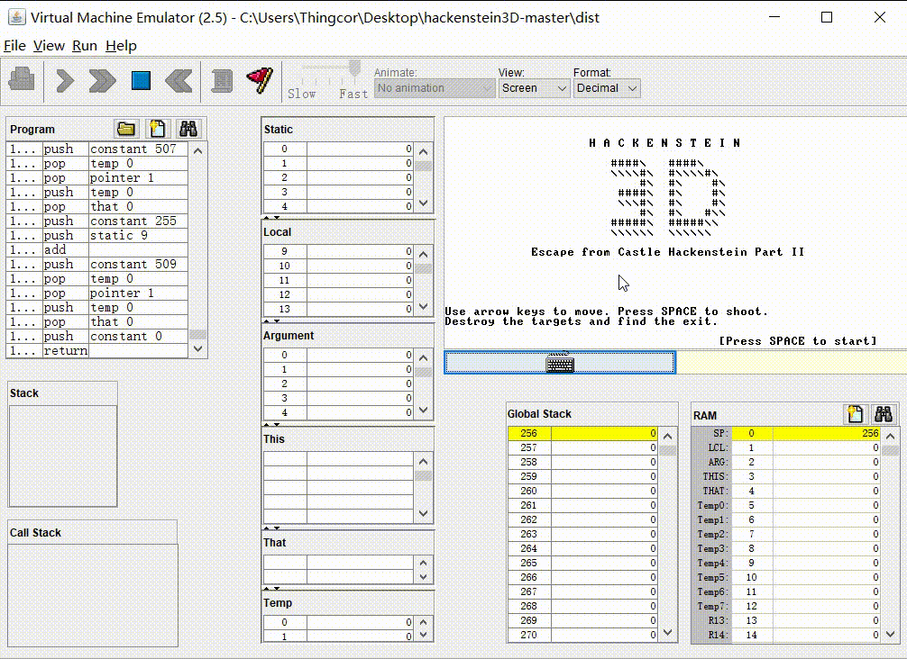

# From NAND to Tetris: Building a Modern Computer From First Principles

**If this repository is helpful to you, please give it a ⭐ or share it with your friends**

Course Website: https://www.nand2tetris.org/

Related Review: https://book.douban.com/review/7115224/

Course Videos [Chinese Subtitles]: https://www.bilibili.com/video/av80737268

Coursera Course: https://www.coursera.org/learn/build-a-computer/home/welcome

CSDN Implementation Details: https://blog.csdn.net/qq_41634283/article/details/103991353

Course Forum: http://nand2tetris-questions-and-answers-forum.32033.n3.nabble.com/

## Course Introduction

This book presents a complete and rigorous picture of computer science by demonstrating the process of building a simple but powerful computer system. The authors believe that the best way to understand how computers work is through hands-on experience, building a computer system from scratch. Through 12 chapters and projects guiding readers from the beginning, this book gradually builds a basic hardware platform and modern software hierarchy. In this process, readers gain detailed knowledge about hardware architecture, operating systems, programming languages, compilers, data structures, algorithms and software engineering. Through this step-by-step construction method, the book reveals important components of computer science knowledge and shows how theories and application techniques from other courses fit into this big picture.

The book follows an "abstraction first, implementation second" approach, with each chapter introducing a key hardware or software abstraction, an implementation method, and a practical project. The computer science knowledge necessary to complete these projects is covered in the book, requiring only programming experience from readers. The companion website provides tools and materials needed to build all hardware and software systems described in the book, as well as 200 test programs for the 12 projects.

The book's content is broad and comprehensive, suitable for undergraduate and graduate students in computer science and related majors, technical developers, teachers and technology enthusiasts.

## Project Demo

## Star History

## Chapter Overview

#### 1. Boolean Logic

This chapter requires implementing basic logic gates. Understanding some digital circuit content is sufficient to complete the project. Everything is implemented based on the NAND gate, though implemented gates can be used when implementing other gates. Other implementation methods are also acceptable. 

- and and16 (AND gate, 16-bit bitwise AND)
- or or16 or8way (OR gate, 16-bit bitwise OR, 8-way OR)
- not not16 (NOT gate, 16-bit bitwise NOT)
- xor (XOR)
- mux mux16 mux4way16 mux8way16 (2-way multiplexor, 16-bit 2-way multiplexor, 16-bit 4-way multiplexor, 16-bit 8-way multiplexor)
- dmux dmux4way dmux8way (demultiplexor, 4-way demultiplexor, 8-way demultiplexor)

#### 2. Boolean Arithmetic 

- 16-bit adder, half adder, full adder
- Incrementer
- ALU

#### 3. Sequential Logic 

- 1-bit register, 16-bit register
- RAM8, RAM64, RAM512, RAM4K, RAM16K
- Program Counter (PC)

#### 4. Machine Language 

- Multiplication program: Input values stored in R0 and R1. Program calculates R0*R1 and stores result in R2.
- I/O handling program

#### 5. Computer Architecture 

- CPU: Build a simple CPU
- Memory: Build a simple memory unit
- Computer: Connect CPU and Memory to complete a full computer platform

#### 6. Assembler 

- Implement an assembler using a high-level language

This project is implemented in Java, but requires manual file path modification in the Assembler class, as command-line usage is not supported.

#### 7. Virtual Machine I: Stack Arithmetic 

- Implement a VM translator that converts high-level language intermediate code to assembly language. This chapter focuses on arithmetic/logical commands and memory access commands.

Implemented in Java but requires manual file path modification in the VMTranslator class, as command-line usage is not supported.

#### 8. Virtual Machine II: Program Control 

- Implement a more complete VM translator supporting arithmetic/logical commands, memory access commands, program control and function calling commands.

Implemented in Java but requires manual file path modification in VMTranslator class (can specify assembly file or folder containing multiple related files). Command-line usage not supported. Plan to create a loader engine for command-line operation after course completion.

#### 9. High-Level Language 

This chapter focuses on Jack language syntax and features. The project demonstrates Jack language execution and is not difficult.

#### 10. Compiler I: Syntax Analysis 

- Implement compiler syntax analysis in a high-level language (Java). Requires manual file path modification, with plans for command-line usage optimization.
- Currently only implemented at basic level without optimization. Needs work on module decoupling, object encapsulation, loader engine, and output paths.
- Optimization goals:
  - Improve method independence. Current design has issues like compileDo method receiving first token before execution.
  - Reduce code redundancy. Code reuse only considered in obvious places, complex methods like compileTerm remain messy.
  - Improve comments for better readability.
- XML file notes:
  - Source files may have expressionList/parameterList tag issues, fixed in this project.
  - xxxG.xml files are Java-generated (G for generate).
  - No xxxT.xml token output as token issues surface in later processing.

Additional experience: Quickly implement a working program then improve through debugging for efficiency. All project files pass testing.

#### 11. Compiler II: Code Generation 

- Implement compiler syntax analysis in Java. Requires manual file path modification, with plans for command-line usage.
- Basic implementation without optimization. Needs work on module decoupling, encapsulation, loader engine, and output paths.
- Known issues:
  - Messy code structure, plan to refactor after compiler theory study
  - Unclear but comprehensible comments
  - Inefficient string constant handling
  - Clumsy object method call handling
- Potential deficiencies:
  - Lacks rigorous theoretical support, though currently compiles correctly
  - String constant handling issues due to lack of theoretical proof

Code compiles correctly but may not handle larger, more complex programs reliably due to lack of theoretical proof. Pong and Square Dance programs run suboptimally.

Main takeaway: Need to study automata theory, including regular languages and state transitions.

#### 12. Operating System 

This chapter implements a simplified OS in Jack language with eight classes: Math, Memory, Screen, Output, Keyboard, String, Array, Sys. Math, Memory, and String are particularly important as they implement fundamental mathematical operations, memory management, and string handling - skills useful beyond OS development.

#### 13. Future Exploration 

- Integrate assembler, VM, and Jack compiler with command-line virtual platform support for complete compilation and execution.
- Code refactoring.
- Potential project ideas:
  - Expand simulation platform memory capacity and redefine memory mapping
  - Add multithreading support
  - More possibilities...
